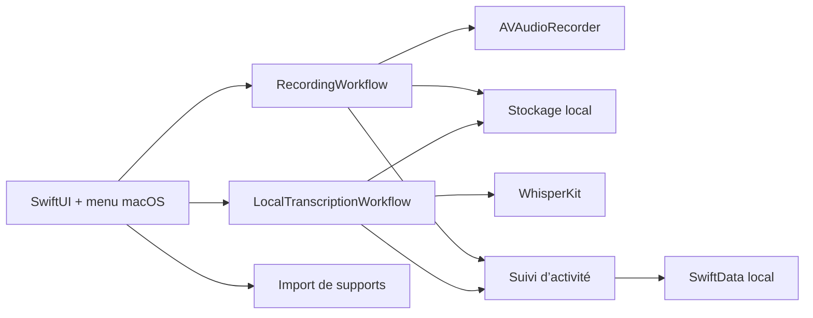
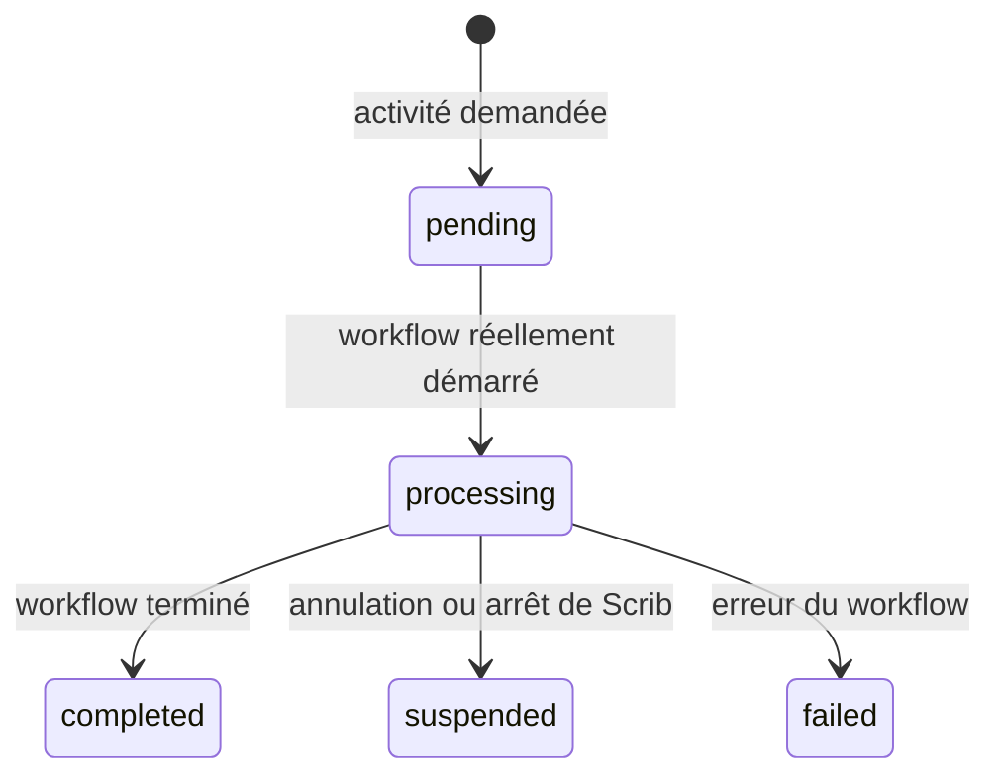

# Architecture technique — Scrib

## 1. Principes

1. **Natif et autonome** : Swift 6, SwiftUI et AppKit ; aucun Python, Homebrew ou
   serveur local à installer sur le Mac cible.
2. **Fiabilité avant débit** : audio segmenté, états persistants et opérations
   idempotentes.
3. **Vérité d’exécution** : le suivi persistant n’exécute rien ; chaque workflow
   concret publie explicitement son propre état.
4. **Local d'abord** : audio, transcription, métadonnées et journaux restent sur
   le Mac. Seuls les textes nécessaires partent vers le fournisseur choisi.
5. **Sortie déterministe préparée** : le module DOCX reçoit des données
   structurées et produit localement le fichier Word ; il n'est pas encore
   déclenché par l'interface.
6. **Frontières utiles** : microphone, transcription, stockage, fournisseur IA
   et services système sont derrière des protocoles. Les abstractions sans
   implémentation ou consommateur ne sont pas conservées.

## 2. Vue d'ensemble



## 3. Modules

### `ScribDomain`

Types Swift purs et testables : identifiant du cours, métadonnées, segments,
statuts d’activité, incidents, estimation de coûts et politique de traitement. Ce
module ne connaît ni SwiftUI, ni AVFoundation, ni le réseau.

### `ScribApplication`

Cas d'usage et ports : enregistrement, transcription locale, édition de la
transcription, import de supports, confidentialité et suivi d'activité. La
génération IA structurée et le rendu DOCX y sont testés séparément, sans action
utilisateur ni orchestration dans le parcours de l'application.
`ProcessingActivityTracker` est un `actor` de persistance : il reçoit les états
émis par l’enregistrement et la transcription locale. Il ne planifie ni ne lance
d’autres traitements.

### `ScribInfrastructure`

Adaptateurs concrets présents dans le dépôt :

- `AVFoundationAudioRecorder` ;
- `SwiftDataProcessingJobRepository` ;
- `WhisperKitTranscriptionEngine` et `WhisperKitModelManager` ;
- `LocalSupportDocumentStore` et `LocalSupportDocumentExtractor` ;
- `OOXMLDocumentRenderer` ;
- `MacCourseFileStore`, `LocalRecordingSessionStore` et `LocalTranscriptionStore` ;
- `MacKeychainSecretStore` et `OpenAIResponsesAdapter`.

### `ScribApp`

Fenêtre SwiftUI, formulaire, enregistreur, suivi d’activité, éditeur de transcription,
réglages et `MenuBarExtra`. AppKit est réservé aux besoins propres à macOS : état
des fenêtres, sélecteurs de fichiers, coordination de fichiers et intégration
Word.

## 4. Suivi persistant des activités



Les activités suivies aujourd’hui sont `recording` et `localTranscription`.
La progression n’est stockée que lorsqu’un workflow réel la fournit ; elle vaut
implicitement 100 % pour un état terminé. Une activité suspendue après fermeture
reste suspendue : aucune reprise automatique n’est promise.

Le magasin SwiftData de ce suivi porte un nouveau nom (`ScribProcessingTracking`).
L’ancien magasin de file n’est pas relu : ses entrées décrivaient une exécution
qui n’existait pas et ne doivent donc plus apparaître comme des travaux en attente.

## 5. Modèle de données minimal

- `Course` : identité, semestre, UE, titre, enseignant, date, durée prévue.
- `Teacher` : identité normalisée, nom et date de confirmation de l'autorisation
  d'enregistrer.
- `RecordingSegment` : URL locale, ordre, durée, empreinte, état de récupération.
- `ProcessingJob` : activité réelle, statut, progression éventuellement signalée,
  motif de suspension ou erreur.
- `TranscriptDraft` : texte horodaté, locuteurs, incertitudes et version.
- `SupportDocument` : type, URL, extraction structurée persistée et éléments
  illisibles.
- `SupportDocumentExtraction` : titre, texte ordonné, niveaux de titres, listes,
  tableaux, pages PDF, nombre d’images, provenance et avertissements.
- `PrivacyReview` : alertes locales de données potentiellement identifiantes,
  décision manuelle et date de validation avant tout envoi cloud.

SwiftData est utilisé pour le suivi des activités. Les manifestes de session,
les transcriptions et les supports ont leur propre stockage local ; les audios
ne sont jamais placés dans SwiftData.

## 6. Stockage

```text
~/Library/Application Support/Scrib/
├── Courses/
│   └── <course-id>/
│       ├── audio/                 segments M4A et manifeste de session
│       ├── transcription/         transcription locale persistée
│       └── supports/              copies de travail
├── Models/                        modèle de transcription choisi
└── AI/                             historique de génération, non raccordé à l’UI
```

Le dossier racine d’un cours est résolu par `MacCourseFileStore` à partir de
`FileManager` : l’application ne suppose donc pas le chemin absolu choisi par
macOS (notamment dans un conteneur App Sandbox). Il contient les audios,
manifestes et transcriptions de ce `CourseID`; l’action « Ouvrir le dossier dans
Finder » ouvre directement cette racine.

Chaque adaptateur possède sa propre persistance locale : manifestes de session,
transcriptions et suivi SwiftData. Il n'existe pas de source de vérité globale,
ni de publication iCloud des DOCX dans l'alpha actuel.

## 7. Enregistrement audio

`AVAudioRecorder` enregistre directement des segments AAC récupérables et fournit
le niveau audio. L'adaptateur demande l'autorisation microphone via
`AVCaptureDevice`, observe les déconnexions et écrit un manifeste de session.

Règles d'implémentation :

- segment courant finalisé régulièrement, au maximum toutes les dix minutes ;
- observation des changements de périphérique et bascule contrôlée ;
- inhibition de veille limitée à l'enregistrement ;
- test de réservation d'espace avant départ et surveillance pendant le cours.

## 8. Transcription locale

Le port `TranscriptionEngine` masque le moteur concret. Il reçoit désormais une
requête explicite contenant le cours, les segments audio ordonnés, la langue, le
modèle et un éventuel contexte initial borné ; il renvoie les passages, mots et
horodatages avec la provenance et les métriques. `LocalTranscriptionCoordinator`
conserve ce résultat brut, construit une version contextualisée séparée et
journalise toute suppression de token ou déduplication. Une frontière n'est
dédupliquée que si les mots et leurs timestamps permettent de recaler le passage.
Aucun chemin global ni singleton audio n’est utilisé.

L'alpha fournit `WhisperKitTranscriptionEngine` au parcours de transcription
locale. Les segments M4A de dix minutes au maximum sont traités un par un,
avec français forcé, température initiale 0, cinq replis de 0,2, seuils WhisperKit
par défaut (compression 2,4, log-probabilité -1, silence 0,6), VAD, timestamps de
mots et un seul worker. Les métadonnées du cours et un petit glossaire sont
encodés comme prompt de décodage ; ils ne corrigent jamais le texte après coup.
Le modèle est déchargé après le traitement. Le téléchargement est une
action utilisateur séparée et les modèles vivent sous Application Support.

Deux candidats natifs restent à benchmarker sur la machine finale : WhisperKit/Core ML et
whisper.cpp/Core ML + Metal. MLX Whisper reste une référence de recherche, car
son exemple officiel actuel dépend de Python et ne peut pas être livré tel quel
sur le Mac cible. Le choix final ne doit imposer ni Python ni Homebrew.

Le benchmark compare d'abord Small avec et sans contexte, puis Small et Medium
sur le même contenu avec :

- fidélité de termes médicaux et horodatages ;
- pic mémoire et pression mémoire ;
- impact sur Word et autonomie ;
- température, stabilité et temps par heure d'audio ;
- taille de modèle sur disque.

Contraintes actuellement appliquées : lot de taille 1, traitement séquentiel et
libération du modèle après la transcription. La suspension thermique et la reprise
par blocs restent des évolutions du workflow de transcription.

La diarisation est une étape séparée et optionnelle : une mauvaise attribution de
locuteur ne doit jamais modifier les mots reconnus.

## 9. Génération cloud et contrôle des sources

Le fournisseur reçoit une requête versionnée et renvoie un schéma JSON comprenant
sections, paragraphes, tableaux, encadrés, références, incertitudes et liens vers
les horodatages. Le JSON est validé avant toute génération Word.

Le contrat `1.0` est matérialisé dans `Schemas/` et doublé d'une validation
sémantique Swift. Avant même cet appel, `PatientIdentifierDetector` et
`CloudPrivacyGate` bloquent localement les contenus potentiellement identifiants
tant qu'une revue liée à leur empreinte exacte n'a pas été approuvée.

La recherche scientifique ne donne jamais un navigateur ouvert au modèle. Un
service local :

1. valide le domaine demandé contre une liste blanche ;
2. récupère la page via HTTPS ;
3. conserve URL canonique, titre, autorité et date d'accès ;
4. rejette les redirections hors liste ;
5. transmet seulement les extraits utiles au modèle ;
6. revalide chaque citation présente dans la réponse structurée.

Les appels réseau sont rejouables avec une clé d'idempotence. Les délais utilisent
une reprise exponentielle avec dispersion, mais aucun fournisseur secondaire
n'est sélectionné sans action explicite.

`StructuredGenerationOrchestrator`, testé mais non raccordé à l'interface,
applique cet ordre : empreinte et barrière de
confidentialité, contrôle d’idempotence, projection budgétaire, lecture de la clé,
appel de l’adaptateur choisi, validation locale du JSON, conversion documentaire
et persistance du résultat avec son usage. Un résultat déjà enregistré est
retourné sans nouvel appel. Les erreurs temporaires sont retentées deux fois ; un
changement de fournisseur reste toujours explicite.

Le premier adaptateur réel utilise `https://api.openai.com/v1/responses`, demande
une sortie JSON Schema stricte et désactive la conservation de la réponse côté
requête (`store: false`). Les profils OpenAI sont un catalogue de benchmark, pas
un choix définitif. Leur tarification est datée et doit être revérifiée avant la
campagne d’essais.

## 10. Rendu DOCX

`OOXMLDocumentRenderer` reçoit un modèle interne validé et construit localement un
package Office Open XML. Il est couvert par des tests mais n'est pas encore
appelé par l'application ; aucune exportation DOCX n'est donc promise à
l'utilisateur.

Le renderer prend en charge : page A4, styles, titres, sommaire statique cliquable,
en-têtes et pieds de page, pagination, tableaux, images accessibles, hyperliens,
liens audio locaux, encadrés, bibliographie et métadonnées. Un sommaire statique
évite de dépendre d'une actualisation de champs Word lors de la première ouverture.

Le prototype utilise un écrivain ZIP minimal en Swift pur, avec entrées stockées,
tri déterministe et CRC32 local. Avant la V1, il sera conservé après audit ou
remplacé par une bibliothèque épinglée si les futurs besoins de compression ou
de compatibilité le justifient. Aucune dépendance globale ne sera installée sur
le Mac.

## 10.1 Extraction des supports

Le port `SupportDocumentExtracting` sépare l’import du décodage. L’adaptateur
local lit les DOCX comme des archives OOXML avec le lecteur ZIP natif minimal du projet,
sans LibreOffice ni service réseau dans l’application. Il extrait uniquement les
parties nécessaires, limite chaque XML à 20 Mio et refuse un package dont les
métadonnées indiquent qu’il a été généré par Scrib. Les images sont comptées et
signalées pour revue, sans interprétation automatique.

Sur macOS, PDFKit fournit le texte page par page. Les pages sans texte sont
conservées dans le résultat avec un avertissement de scan possible ; aucun OCR
n’est inventé. Les PDF verrouillés et les documents corrompus produisent un état
d’erreur visible, tandis que la copie locale reste maîtrisée par le magasin de
supports.

## 11. Ressources et exécution macOS

- Une activité système est ouverte uniquement pendant l'enregistrement et, si
  nécessaire, pendant la transcription locale.
- L'absence de fenêtre n'arrête pas le processus ; quitter explicitement
  l'application demande confirmation si une opération est active.
- Les mesures de température, mémoire, secteur et réseau servent aujourd’hui au
  diagnostic et aux benchmarks. Elles ne suspendent ni ne relancent un workflow
  via le suivi persistant.

## 12. Sécurité

- clés API dans le Trousseau ;
- secrets non synchronisables, accessibles uniquement lorsque la session est
  déverrouillée et jamais recopiés dans `UserDefaults` ;
- App Sandbox et droits minimums : microphone, notifications, fichiers choisis et
  conteneur iCloud ;
- transport TLS, domaines explicitement autorisés ;
- aucun secret dans les réglages exportables ni les journaux ;
- journaux structurés, rotation et purge ;
- extraits de cours désactivés par défaut sauf incident nécessitant un diagnostic ;
- manifeste de confidentialité et vérification des SDK tiers avant distribution.

## 13. Build, distribution et mise à jour

Le développement et la signature peuvent se faire hors du Mac cible. La première
distribution vise une archive d'application autonome. Sans abonnement Apple
Developer, macOS demandera une autorisation manuelle à la première ouverture ; la
notarisation pourra être ajoutée ultérieurement.

Les mises à jour sont prévues via un petit programme « Mise à jour Scrib » lancé
manuellement. Ce composant vérifiera une version publiée, téléchargera, vérifiera
une empreinte/signature, puis remplacera Scrib quand l'application est fermée. Il
n'est pas implémenté dans le socle actuel.

## 14. Références techniques

- [AVAudioRecorder — Apple](https://developer.apple.com/documentation/avfaudio/avaudiorecorder)
- [ModelContainer / SwiftData — Apple](https://developer.apple.com/documentation/swiftdata/modelcontainer)
- [ProcessInfo — Apple](https://developer.apple.com/documentation/foundation/processinfo)
- [MLX Swift — Apple ML Research](https://github.com/ml-explore/mlx-swift)
- [Exemple Whisper MLX](https://github.com/ml-explore/mlx-examples/tree/main/whisper)
- [WhisperKit / Argmax OSS](https://github.com/argmaxinc/argmax-oss-swift)
- [whisper.cpp](https://github.com/ggml-org/whisper.cpp)
