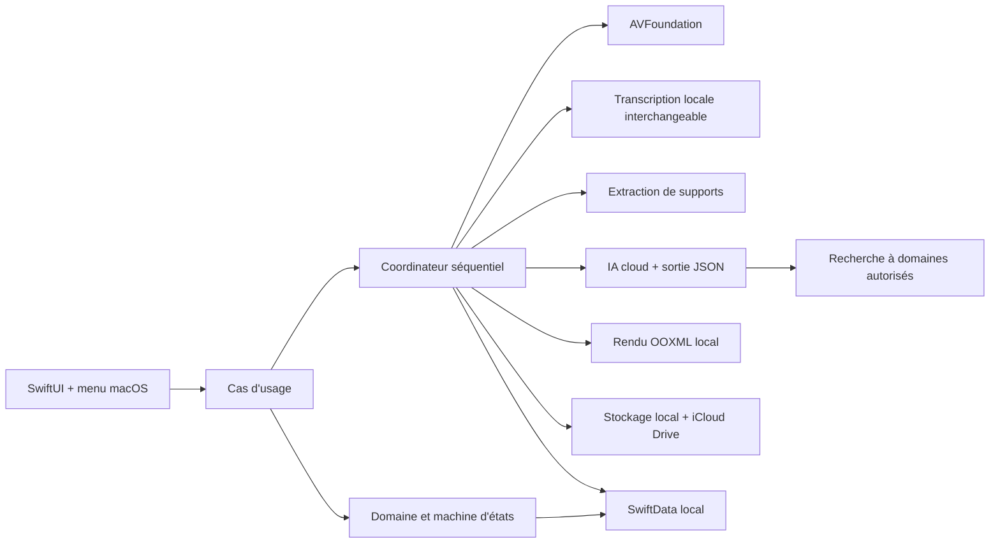
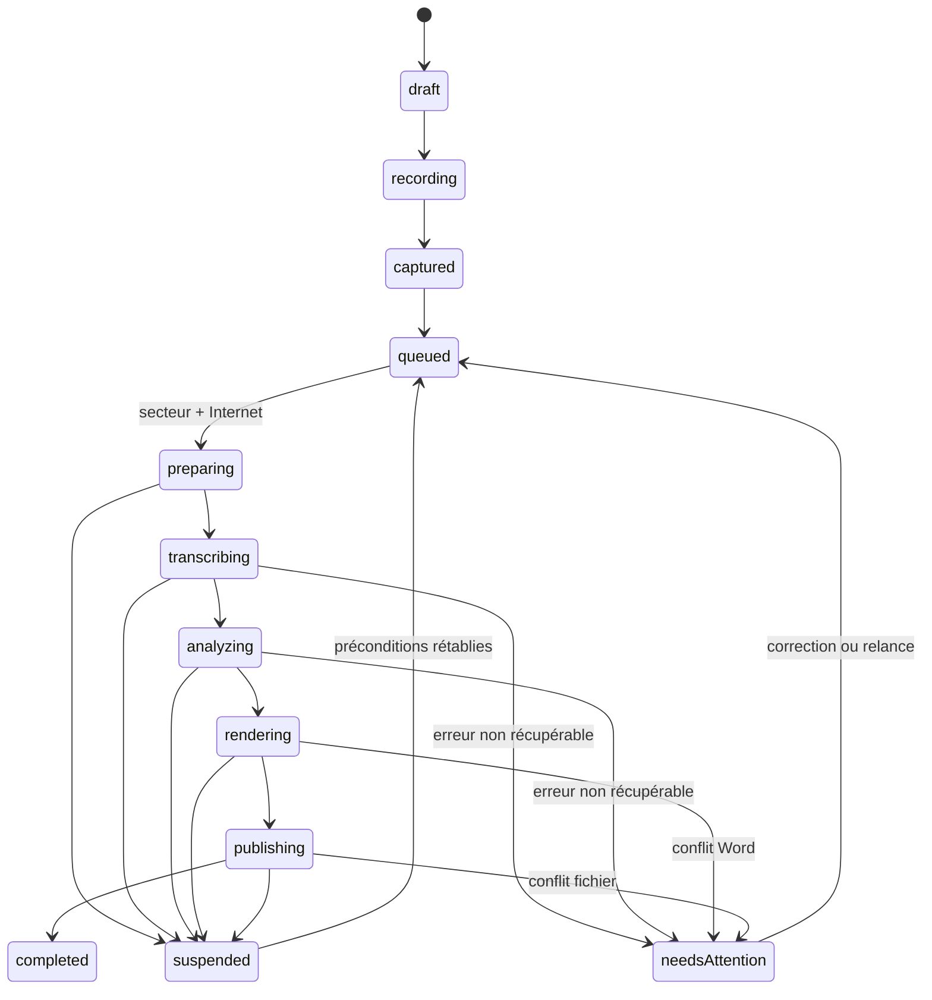

# Architecture technique — Scrib

## 1. Principes

1. **Natif et autonome** : Swift 6, SwiftUI et AppKit ; aucun Python, Homebrew ou
   serveur local à installer sur le Mac cible.
2. **Fiabilité avant débit** : audio segmenté, états persistants et opérations
   idempotentes.
3. **Une seule charge lourde** : acteur d'orchestration séquentiel, profil de
   ressources bas et préemption immédiate par l'enregistrement.
4. **Local d'abord** : audio, transcription, métadonnées et journaux restent sur
   le Mac. Seuls les textes nécessaires partent vers le fournisseur choisi.
5. **Sortie déterministe** : l'IA renvoie des données structurées ; Scrib rend le
   DOCX localement. Le modèle ne fabrique pas directement le fichier final.
6. **Choix réversibles** : transcription, IA, recherche, extraction de supports,
   DOCX et stockage sont derrière des protocoles.

## 2. Vue d'ensemble



## 3. Modules

### `ScribDomain`

Types Swift purs et testables : identifiant du cours, métadonnées, segments,
étapes, statuts, incidents, estimation de coûts et politique de traitement. Ce
module ne connaît ni SwiftUI, ni AVFoundation, ni le réseau.

### `ScribApplication`

Cas d'usage et ports : démarrer/arrêter l'enregistrement, clôturer un cours,
planifier, reprendre, corriger la transcription, régénérer un document et décider
du sort de l'audio. Ils couvrent aussi la confirmation d'autorisation par
enseignant et la levée manuelle d'une alerte de données patient.
`ProcessingCoordinator` sera un `actor` afin qu'une seule transition de la file
soit active.

### `ScribInfrastructure`

Adaptateurs concrets, ajoutés progressivement :

- `AVFoundationAudioRecorder` ;
- `SwiftDataCourseRepository` ;
- `SystemConditionMonitor` (secteur, réseau, pression mémoire, état thermique) ;
- `LocalTranscriptionAdapter` ;
- `CloudGenerationAdapter` ;
- `AllowlistedResearchAdapter` ;
- `OfficeSupportExtractor` et `VisionSupportExtractor` ;
- `OOXMLDocumentRenderer` ;
- `LocalCourseFileStore` et `ICloudPublisher` ;
- `KeychainSecretStore` ;
- `UserNotificationAdapter`.

### `ScribApp`

Fenêtre SwiftUI, formulaire, enregistreur, file, éditeur de transcription,
réglages et `MenuBarExtra`. AppKit est réservé aux besoins propres à macOS : état
des fenêtres, sélecteurs de fichiers, coordination de fichiers et intégration
Word.

## 4. Machine d'états persistante



Chaque transition écrit : statut, étape, progression, nombre de tentatives,
entrée(s), sortie(s), date, version du moteur et empreinte du contenu. Une étape
déjà terminée n'est rejouée que si une de ses entrées change.

## 5. Modèle de données minimal

- `Course` : identité, semestre, UE, titre, enseignant, date, durée prévue.
- `Teacher` : identité normalisée, nom et date de confirmation de l'autorisation
  d'enregistrer.
- `RecordingSegment` : URL locale, ordre, durée, empreinte, état de récupération.
- `ProcessingJob` : étape, statut, progression, tentatives et prochaine reprise.
- `Artifact` : type, URL, empreinte, version source et état iCloud.
- `TranscriptRevision` : texte horodaté, locuteurs, incertitudes et version.
- `SupportDocument` : type, URL, extraction structurée persistée et éléments
  illisibles.
- `SupportDocumentExtraction` : titre, texte ordonné, niveaux de titres, listes,
  tableaux, pages PDF, nombre d’images, provenance et avertissements.
- `UsageRecord` : fournisseur, modèle, jetons, coût estimé et mois.
- `Incident` : catégorie, code, message, extrait optionnel et résolution.
- `PrivacyReview` : alertes locales de données potentiellement identifiantes,
  décision manuelle et date de validation avant tout envoi cloud.

SwiftData stocke les métadonnées et références de fichiers. Les audios et grands
artefacts ne sont jamais placés dans la base.

## 6. Stockage

```text
~/Library/Application Support/Scrib/
├── Store/                         base locale
├── Courses/
│   └── <course-id>/
│       ├── audio/                 segments et audio fusionné
│       ├── transcript/            versions horodatées
│       ├── supports/              copies de travail
│       ├── output/                DOCX locaux validés
│       └── temp/                  supprimé après succès
├── Models/                        modèle de transcription choisi
└── Diagnostics/                   journaux bornés

iCloud Drive/Scrib/
└── <Semestre – UE – titre – date>/
    ├── Cours complet.docx
    └── Fiche de révision.docx
```

Les écritures utilisent un fichier temporaire dans le même volume, puis un
remplacement atomique. La coordination de fichiers protège les interactions avec
Word et iCloud. La base locale est la source de vérité ; iCloud ne sert qu'à
publier les deux documents finaux.

## 7. Enregistrement audio

`AVAudioEngine` fournit le flux du périphérique d'entrée. L'adaptateur écrit des
segments récupérables et mesure le niveau sans traitement coûteux sur le thread
temps réel. La compression, la fusion et le nettoyage sont différés.

Règles d'implémentation :

- aucun accès disque, log détaillé ou allocation importante dans le callback
  audio ;
- segment courant finalisé régulièrement, au maximum toutes les dix minutes ;
- observation des changements de périphérique et bascule contrôlée ;
- inhibition de veille limitée à l'enregistrement ;
- test de réservation d'espace avant départ et surveillance pendant le cours.

## 8. Transcription locale

Le port `TranscriptionEngine` masque le moteur concret. Deux candidats natifs
seront benchmarkés sur la machine finale : WhisperKit/Core ML et
whisper.cpp/Core ML + Metal. MLX Whisper reste une référence de recherche, car
son exemple officiel actuel dépend de Python et ne peut pas être livré tel quel
sur le Mac cible. Le choix final ne doit imposer ni Python ni Homebrew.

Le benchmark compare Small, Medium quantifié et Large-v3-Turbo quantifié avec :

- fidélité de termes médicaux et horodatages ;
- pic mémoire et pression mémoire ;
- impact sur Word et autonomie ;
- température, stabilité et temps par heure d'audio ;
- taille de modèle sur disque.

Contraintes fixes : lot de taille 1, traitement séquentiel, libération du modèle
après l'étape, suspension aux états thermiques sérieux/critiques et possibilité de
reprendre par blocs.

La diarisation est une étape séparée et optionnelle : une mauvaise attribution de
locuteur ne doit jamais modifier les mots reconnus.

## 9. Génération cloud et contrôle des sources

Le fournisseur reçoit une requête versionnée et renvoie un schéma JSON comprenant
sections, paragraphes, tableaux, encadrés, références, incertitudes et liens vers
les horodatages. Le JSON est validé avant toute génération Word.

Le contrat `1.0` est matérialisé dans `Schemas/` et doublé d'une validation
sémantique Swift. Avant même cet appel, `PatientIdentifierDetector` et
`CloudPrivacyGate` bloquent localement les contenus potentiellement identifiants
tant qu'une revue liée à leur empreinte exacte n'a pas été approuvée.

La recherche scientifique ne donne jamais un navigateur ouvert au modèle. Un
service local :

1. valide le domaine demandé contre une liste blanche ;
2. récupère la page via HTTPS ;
3. conserve URL canonique, titre, autorité et date d'accès ;
4. rejette les redirections hors liste ;
5. transmet seulement les extraits utiles au modèle ;
6. revalide chaque citation présente dans la réponse structurée.

Les appels réseau sont rejouables avec une clé d'idempotence. Les délais utilisent
une reprise exponentielle avec dispersion, mais aucun fournisseur secondaire
n'est sélectionné sans action explicite.

`StructuredGenerationOrchestrator` applique cet ordre : empreinte et barrière de
confidentialité, contrôle d’idempotence, projection budgétaire, lecture de la clé,
appel de l’adaptateur choisi, validation locale du JSON, conversion documentaire
et persistance du résultat avec son usage. Un résultat déjà enregistré est
retourné sans nouvel appel. Les erreurs temporaires sont retentées deux fois ; un
changement de fournisseur reste toujours explicite.

Le premier adaptateur réel utilise `https://api.openai.com/v1/responses`, demande
une sortie JSON Schema stricte et désactive la conservation de la réponse côté
requête (`store: false`). Les profils OpenAI sont un catalogue de benchmark, pas
un choix définitif. Leur tarification est datée et doit être revérifiée avant la
campagne d’essais. Le simulateur local passe par le même orchestrateur et le même
validateur, avec un coût nul.

## 10. Rendu DOCX

`OOXMLDocumentRenderer` reçoit un modèle interne validé et construit localement un
package Office Open XML. Cette approche évite de confier la mise en page finale au
modèle et n'exige pas que Word soit piloté pendant le traitement.

Le renderer prend en charge : page A4, styles, titres, sommaire statique cliquable,
en-têtes et pieds de page, pagination, tableaux, images accessibles, hyperliens,
liens audio locaux, encadrés, bibliographie et métadonnées. Un sommaire statique
évite de dépendre d'une actualisation de champs Word lors de la première ouverture.

Le prototype utilise un écrivain ZIP minimal en Swift pur, avec entrées stockées,
tri déterministe et CRC32 local. Avant la V1, il sera conservé après audit ou
remplacé par une bibliothèque épinglée si les futurs besoins de compression ou
de compatibilité le justifient. Aucune dépendance globale ne sera installée sur
le Mac.

## 10.1 Extraction des supports

Le port `SupportDocumentExtracting` sépare l’import du décodage. L’adaptateur
local lit les DOCX comme des archives OOXML avec ZIPFoundation 0.9.20 épinglé,
sans LibreOffice ni service réseau dans l’application. Il extrait uniquement les
parties nécessaires, limite chaque XML à 20 Mio et refuse un package dont les
métadonnées indiquent qu’il a été généré par Scrib. Les images sont comptées et
signalées pour revue, sans interprétation automatique.

Sur macOS, PDFKit fournit le texte page par page. Les pages sans texte sont
conservées dans le résultat avec un avertissement de scan possible ; aucun OCR
n’est inventé. Les PDF verrouillés et les documents corrompus produisent un état
d’erreur visible, tandis que la copie locale reste maîtrisée par le magasin de
supports.

## 11. Ressources et exécution macOS

- `ProcessInfo.thermalState` et ses notifications pilotent la suspension thermique.
- La pression mémoire déclenche la libération des caches et la suspension de
  l'étape lourde au prochain checkpoint sûr.
- Une activité système est ouverte uniquement pendant l'enregistrement et, si
  nécessaire, pendant la transcription locale.
- La présence du secteur est une précondition du coordinateur.
- L'absence de fenêtre n'arrête pas le processus ; quitter explicitement
  l'application demande confirmation si une opération est active.
- La file demeure volontairement séquentielle sur 8 Go.

## 12. Sécurité

- clés API dans le Trousseau ;
- secrets non synchronisables, accessibles uniquement lorsque la session est
  déverrouillée et jamais recopiés dans `UserDefaults` ;
- App Sandbox et droits minimums : microphone, notifications, fichiers choisis et
  conteneur iCloud ;
- transport TLS, domaines explicitement autorisés ;
- aucun secret dans les réglages exportables ni les journaux ;
- journaux structurés, rotation et purge ;
- extraits de cours désactivés par défaut sauf incident nécessitant un diagnostic ;
- manifeste de confidentialité et vérification des SDK tiers avant distribution.

## 13. Build, distribution et mise à jour

Le développement et la signature peuvent se faire hors du Mac cible. La première
distribution vise une archive d'application autonome. Sans abonnement Apple
Developer, macOS demandera une autorisation manuelle à la première ouverture ; la
notarisation pourra être ajoutée ultérieurement.

Les mises à jour sont prévues via un petit programme « Mise à jour Scrib » lancé
manuellement. Ce composant vérifiera une version publiée, téléchargera, vérifiera
une empreinte/signature, puis remplacera Scrib quand l'application est fermée. Il
n'est pas implémenté dans le socle actuel.

## 14. Références techniques

- [AVAudioEngine — Apple](https://developer.apple.com/documentation/avfaudio/avaudioengine)
- [ModelContainer / SwiftData — Apple](https://developer.apple.com/documentation/swiftdata/modelcontainer)
- [ProcessInfo — Apple](https://developer.apple.com/documentation/foundation/processinfo)
- [MLX Swift — Apple ML Research](https://github.com/ml-explore/mlx-swift)
- [Exemple Whisper MLX](https://github.com/ml-explore/mlx-examples/tree/main/whisper)
- [WhisperKit / Argmax OSS](https://github.com/argmaxinc/argmax-oss-swift)
- [whisper.cpp](https://github.com/ggml-org/whisper.cpp)
